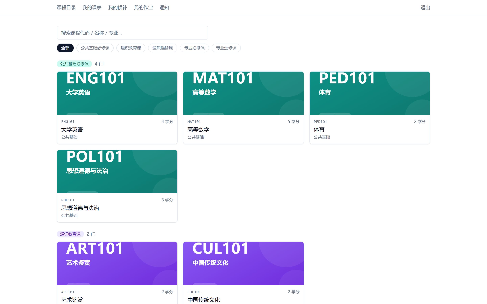
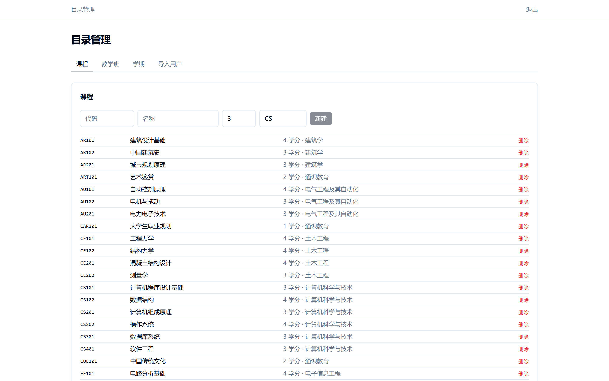
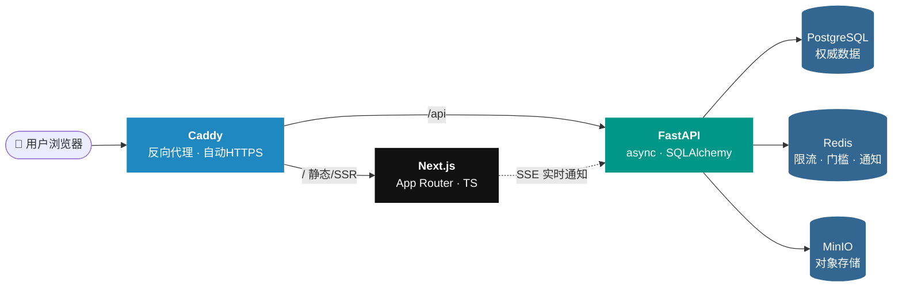

<div align="center">

# 🎓 选课系统 · Course Registration System

**一个前后端分离、真实可用、可一键部署的学校选课系统。**

从防超卖的选课引擎，到 SSE 实时通知，再到 Docker Compose 一键上线 —— 一个完整的全栈工程项目。

<br/>

<a href="http://114.55.96.132"></a>


<br/><br/>

<a href="http://114.55.96.132"></a>
<a href="./SPEC.md"></a>
<a href="./DEPLOY.md"></a>

</div>

---

## ✨ 核心特性

<table>
<tr>
<td width="50%">

🛡️ **防超卖选课引擎**
FCFS 先到先得 + 原子操作，高并发下绝不超卖，满员自动转候补

</td>
<td width="50%">

⚡ **SSE 实时通知**
选课结果、候补位次变化实时推送到浏览器，无需刷新

</td>
</tr>
<tr>
<td width="50%">

🔐 **完整认证体系**
Session + 三种角色（学生 / 教师 / 管理员）+ 批量导入 + 首登强制改密

</td>
<td width="50%">

🐳 **一键容器化部署**
6 个服务一条命令拉起，Caddy 自动 HTTPS，云服务器零配置上线

</td>
</tr>
<tr>
<td width="50%">

📊 **压测验证**
内置 Locust 压测脚本，真实模拟选课高峰，验证系统承载能力

</td>
<td width="50%">

📝 **作业模块 + 对象存储**
MinIO 管理附件，教师发布作业、学生提交、在线批改闭环

</td>
</tr>
</table>

---

## 🖼️ 界面预览

> 🟢 以下截图均来自 [在线演示](http://114.55.96.132)，真实运行界面，点击即可体验。

<div align="center">

**🎓 学生选课端** · 课程目录 / 我的课表 / 我的候补 / 我的作业，分类清晰一目了然



<br/><br/>

<table>
<tr>
<td width="50%" align="center">

**🔐 登录页**


</td>
<td width="50%" align="center">

**⚙️ 管理后台 · 目录管理**



</td>
</tr>
</table>

</div>

---

## 🏗️ 系统架构



---

## 🛠️ 技术栈

<div align="center">


<br/><br/>


</div>

| 层 | 技术 |
|---|---|
| **前端** | Next.js (App Router) · TypeScript · Tailwind · shadcn/ui · TanStack Query |
| **后端** | FastAPI (async) · async SQLAlchemy · asyncpg · SSE 实时 |
| **数据** | PostgreSQL（权威）· Redis（门槛/限流/通知）· MinIO（对象存储） |
| **基建** | Caddy（自动 HTTPS）· Docker Compose · Locust（压测） |

---

## 🚀 快速开始

```bash
cp .env.example .env          # 按需修改密码 / 密钥
docker compose up -d --build  # 一条命令拉起全部 6 个服务
```

| 服务 | 地址 |
|---|---|
| 🖥️ 前端 | http://localhost |
| 🩺 后端健康检查 | http://localhost/api/health |
| 📦 MinIO 控制台 | http://localhost:9001 |

> 本地默认走 HTTP（`:80`）。部署到真实域名时，把 `.env` 里 `SITE_ADDRESS` 改成域名，Caddy 会自动启用 HTTPS。

<details>
<summary><b>🔬 数据层初始化（建表 + 演示数据）</b></summary>

```bash
docker compose up -d --build db api
docker compose exec api alembic upgrade head        # 建表
docker compose exec api python -m scripts.seed_data # 播种（幂等；--reset 强制重建）
```

**演示账号：**
- 管理员：`admin@seed.example.com` / `Admin#2026`
- 学生 / 教师初始口令：`InitPass#2026`（首登强制改密）

- `/health/ready` 会真实探测 DB：DB 不可达返回 **503**。
- `scripts/seed_data.py` 位于 `backend/scripts/`，随 api 镜像发布。

</details>

---

## 🌐 部署上线（分享给别人）

把系统部署到云服务器，拿到公网链接发给别人，对方用浏览器即可访问、**无需安装任何东西**。

完整步骤见 **[DEPLOY.md](./DEPLOY.md)**，覆盖：
- ☁️ 阿里云：安全组、Docker 国内加速、2GB 内存加 swap
- 🌍 公网 IP HTTP 部署、建表播种、压测演示
- 📊 压测脚本：`loadtest/locustfile.py`

> 🟢 **当前演示部署**：[http://114.55.96.132](http://114.55.96.132)

---

## 📅 里程碑进度

<div align="center">


</div>

| # | 里程碑 | 状态 |
|---|---|:---:|
| M0 | 脚手架 + 基础设施 | ✅ |
| M1 | 数据层（模型 + 迁移 + 种子） | ✅ |
| M2 | 认证（Session + 角色 + 批量导入） | ✅ |
| M3 | 目录浏览 API | ✅ |
| M4 | 选课引擎（FCFS + 防超卖 + 候补） | ✅ |
| M5 | 学生端前端 + 实时通知 | ✅ |
| M6 | 作业模块 | ✅ |
| M7 | 教师 & 管理员前端 | ✅ |
| M8 | 压测演示 + 上线 | ✅ |

---

## 📚 更多文档

- 📐 **[SPEC.md](./SPEC.md)** — 完整系统设计文档（数据模型、API、选课引擎、架构图）
- 🚀 **[DEPLOY.md](./DEPLOY.md)** — 一步步部署到云服务器

<br/>

<div align="center">

<sub>Built with ❤️ by <a href="https://github.com/Claire2039">@Claire2039</a></sub>

</div>
